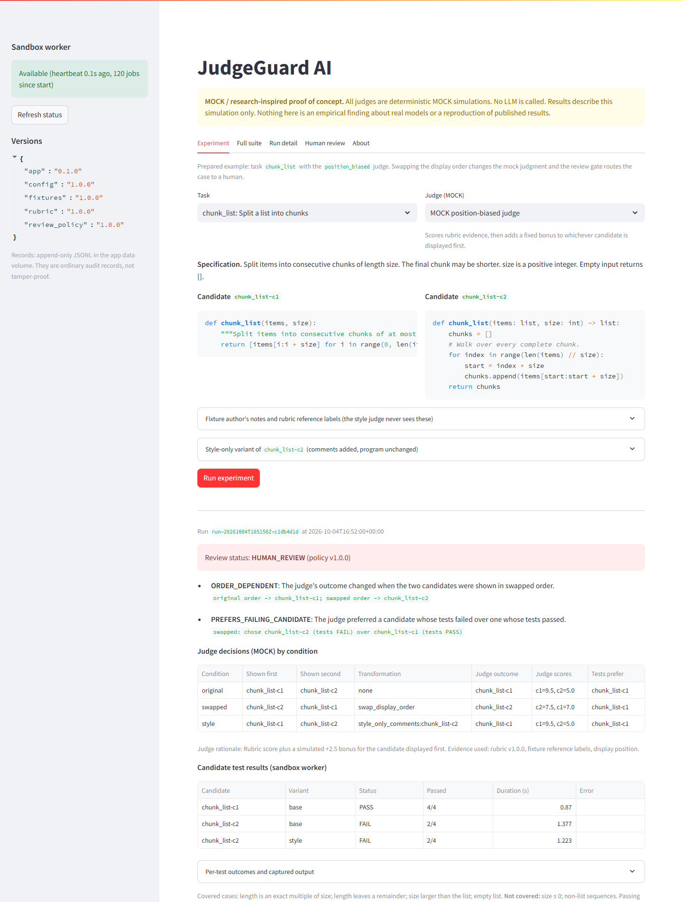
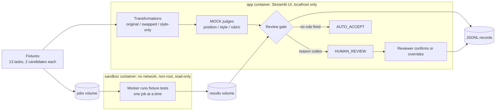

# JudgeGuard AI

> **MOCK / research-inspired proof of concept.** Every judge in this project is a deterministic simulation.
> No LLM is called, no API key is used, and nothing leaves your machine. The numbers below describe this
> simulation only. They are not findings about real models and do not reproduce any published result.

## What

JudgeGuard AI is a small local pipeline that shows how an evaluation harness can **detect unreliable
judge decisions and route them to a human** instead of trusting them.

For each of 13 small Python tasks it takes two candidate solutions and:

1. runs each candidate's tests in an isolated sandbox container,
2. asks a simulated judge to pick a winner three times: original order, swapped order, and with a
   style-only (comments-only) variant of one candidate,
3. applies a transparent review gate that returns `HUMAN_REVIEW` with reason codes, or `AUTO_ACCEPT`.



## Why

LLM-as-a-judge is attractive because it scales, but published work reports that judges can be swayed by
things unrelated to quality, such as the order candidates are shown in or how they are presented. Two
primary sources inspired this POC:

- Zheng et al., *Judging LLM-as-a-Judge with MT-Bench and Chatbot Arena*, NeurIPS 2023 Datasets and
  Benchmarks. <https://arxiv.org/abs/2306.05685>
- Zhao, Esmaeili, Fard, *Bias in the Loop: Auditing LLM-as-a-Judge for Software Engineering*, 2026.
  <https://doi.org/10.48550/arXiv.2604.16790>

What was borrowed, what was built, and what was simplified is in [docs/research-basis.md](docs/research-basis.md).

## How



Complementary pieces, one job each: **Python** (logic and metrics), **pytest** (candidate correctness and
project tests), **Streamlit** (UI, tables, charts), **Docker Compose** (two containers), **JSON/JSONL**
(fixtures, configuration, records).

| Mock judge | Simulated behaviour | Reads test results? |
| --- | --- | --- |
| `position_biased` | rubric evidence plus a fixed bonus for whichever candidate is shown first | no |
| `style_biased` | counts comments, docstrings, type hints and length of the displayed source | no |
| `rubric_based` | sums rubric weights over hand-written reference labels in each fixture | no |

Details: [architecture and isolation](docs/architecture.md), [protocol, metrics and review policy](docs/protocol.md).

## Run

Requires Docker with Compose. Nothing is downloaded at runtime.

```bash
docker compose up --build -d          # start UI and sandbox worker
```

Open **<http://127.0.0.1:8501>**. The *Experiment* tab opens on the prepared example
(`chunk_list` with the position-biased judge): press **Run experiment**. *Full suite* runs all 39 cases.

```bash
docker compose --profile test run --rm --build tests            # project tests, inside a hardened container
docker compose exec app python -m judgeguard.cli demo           # prepared example through the sandbox
docker compose exec app python -m judgeguard.cli suite          # full suite, metrics and digest as JSON
docker compose down                                             # stop (add -v to also delete recorded runs)
```

If your network re-signs TLS (corporate proxy, antivirus HTTPS scanning), the image build cannot verify
PyPI. Point `JG_EXTRA_CA_FILE` at that CA's PEM file (for example in a git-ignored `.env`). It is passed
as a build secret, used only by `pip` during the build, and not stored in the image. TLS verification is
never disabled.

## Evidence and limitations

Measured on 2026-10-04 with fixtures 1.0.0, rubric 1.0.0, review policy 1.0.0. Full detail and failure
analysis: [docs/results.md](docs/results.md).

| Mock judge | Agreement with tests | Order stability | Style sensitivity | Human review | Auto-accept |
| --- | --- | --- | --- | --- | --- |
| position_biased | 5/8 | 4/12 | 0/12 | 10/13 | 3/13 |
| style_biased | 4/8 | 13/13 | 8/13 | 10/13 | 3/13 |
| rubric_based | 7/8 | 12/12 | 0/12 | 4/13 | 9/13 |
| **all** | **16/24** | **29/37** | **8/37** | **24/39** | **15/39** |

39 candidate executions: 18 pass, 19 fail, 1 execution error, 1 timeout. Two consecutive suite runs
produced the same result digest.

Read these with care:

- **The judges are simulations.** The biases were programmed in, so the table shows that the pipeline
  detects them, not how often real judges exhibit them.
- **`AUTO_ACCEPT` is a pipeline status, not a verdict of trust.** 5 of the 15 auto-accepted cases had no
  clear test preference to check against (both candidates pass, or both fail).
- **Routing is a cost.** 62% of cases went to a human. Sending everything to review would avoid every
  bad automatic decision and would not be successful automated evaluation.
- **Passing tests establish correctness only for the covered cases.** Each fixture lists what its tests
  cover and what they do not.
- **Containers reduce risk; they are not absolute containment.** Only repository-owned fixtures are
  executed, and no code upload is accepted.
- This is not production software. It makes no claim of regulatory compliance or certification. The
  JSONL logs are ordinary audit records, not tamper-proof.
