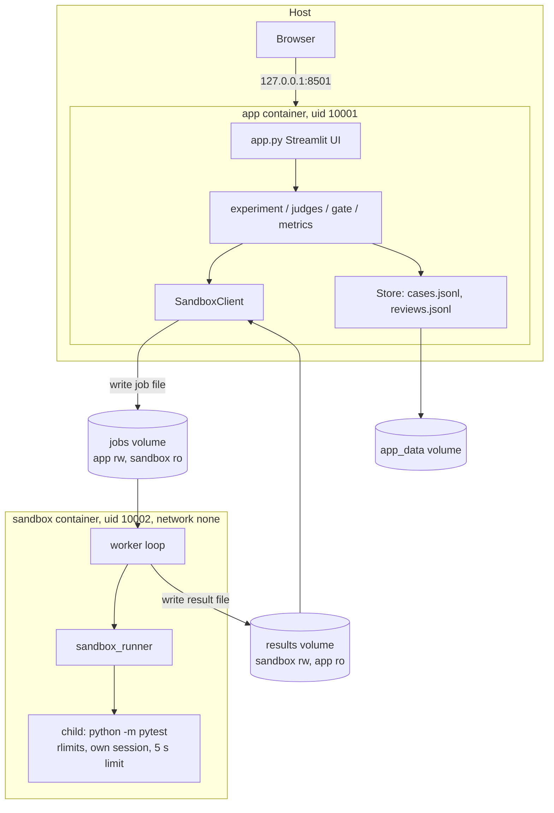

# Architecture, isolation and threat assumptions

## Components

| Path | Role |
| --- | --- |
| `judgeguard/` | Standard-library package shared by both images: fixtures, transforms, judges, gate, metrics, store, job exchange, worker, runner, CLI |
| `app.py` | Streamlit UI. The only code that imports Streamlit |
| `fixtures/` | `manifest.json` (allow-list and fixtures version) and one directory per task |
| `config/` | `experiment.json` (judges, sandbox limits, prepared demo), `rubric.json`, `review_policy.json` |
| `tests/` | Project tests |
| `Dockerfile` | One file, three targets: `sandbox`, `tests`, `app` |

## Job and result exchange

There is no network path to the worker. The two containers share two named volumes and nothing else.

1. The app validates the request against the fixture allow-list and writes
   `jobs/<job_id>.json` via a temporary file and an atomic rename.
2. The worker lists the jobs directory, ignores names that are not 32 hex characters plus `.json`,
   and skips any job that already has a result.
3. The worker validates the job: exact key set, schema version, job ID equal to the file name, known
   task and candidate, allowed variant, creation time within 120 s. Invalid jobs get a `REJECTED`
   result and are never executed.
4. Valid jobs run one at a time. The result is written atomically to `results/<job_id>.json`.
5. The app polls for the result, then deletes its job file whether it got a result or not.

| Situation | Handling |
| --- | --- |
| Half-written job file | Not visible under its final name (atomic rename). An unreadable file is retried for 2 s, then rejected |
| Same execution requested twice | Job ID is a hash of run, task, candidate and variant, so both requests map to one job and one result |
| Worker down | Heartbeat older than 12 s: the app reports the worker unavailable, disables the run buttons, and returns `MISSING` results. It never runs candidate code itself |
| No result in time | After timeout plus 15 s the app records `MISSING` and withdraws the job |
| Stale job files | Rejected by the worker after 120 s; removable by the app (`prune_stale_jobs`) |
| Old result files | Deleted by the worker after 15 minutes |
| Malformed result | Treated as `MISSING` |

`MISSING`, `REJECTED`, `ERROR` and `TIMEOUT` all route the case to human review.

## Isolation settings

Applied in `docker-compose.yml` and confirmed on running containers (see [results.md](results.md)).

| Control | sandbox | app |
| --- | --- | --- |
| Network | `network_mode: none` (loopback only) | default bridge, port published on `127.0.0.1` only |
| User | 10002, non-root | 10001, non-root |
| Privileged | no | no |
| Capabilities | all dropped | all dropped |
| `no-new-privileges` | yes | yes |
| Root filesystem | read-only | read-only |
| Writable space | `/tmp` tmpfs 32 MB (`noexec,nosuid,nodev`), results volume | `/tmp` tmpfs 64 MB, jobs and data volumes |
| Memory / swap | 256 MB / none | 768 MB / none |
| CPU | 0.5 | 1.0 |
| Process limit | 64 | 128 |
| Docker socket or daemon API | not mounted, not reachable | not mounted |
| Host directories | none (named volumes only) | none (named volumes only) |
| Published ports | none | 8501 on localhost |

Inside the sandbox, each job additionally gets:

- a fresh work directory under `/tmp`, removed after success, failure or timeout;
- a child process in its own session with `RLIMIT_CPU`, `RLIMIT_AS` (512 MB), `RLIMIT_FSIZE` (1 MB),
  `RLIMIT_NOFILE` (64), `RLIMIT_NPROC` (48) and no core dumps;
- a 5 s wall-clock limit, after which the whole process group is killed;
- a minimal environment (no variables inherited from the worker);
- captured output truncated to 8,000 bytes.

The `tests` service runs fixture code too, so it uses the same hardening and has no network.

There is no Docker-in-Docker. The sandbox container itself is the isolation boundary.

## Threat assumptions

Assumed:

- Fixtures are written and reviewed by the repository owner. They may be buggy (infinite loops, import
  errors, excessive output) but are not adversarial exploits.
- The host, Docker engine and kernel are trusted and patched.
- The user is the only person with access to `127.0.0.1:8501`. The UI has no authentication.

Deliberately out of scope: arbitrary code upload. The UI offers only fixture IDs from the manifest, and
both the app and the worker reject anything else.

## Limitations of the boundary

Containers reduce risk. They do not provide absolute containment.

- Containers share the host kernel (on Docker Desktop, the kernel of its Linux VM). A kernel or runtime
  escape vulnerability would defeat this boundary. No user-namespace remapping, gVisor or VM-level
  isolation is used, and seccomp is Docker's default profile.
- Candidate code runs as the same user as the worker inside the container. It can read the fixture
  files and the jobs volume, and could write to the results volume, so a hostile candidate could forge
  result files. Results are therefore not trustworthy against adversarial code.
- Tests and candidate run in the same pytest process, and the per-test report is written by that
  process. A candidate could tamper with its own report. This is acceptable only because fixtures are
  repository-owned.
- `noexec` on `/tmp` blocks native binaries, not interpreted Python.
- `RLIMIT_NPROC` is counted per user ID, not per job. The container `pids_limit` is the firmer bound.
- The app container has outbound network access through the default bridge. The application makes no
  outbound calls and Streamlit usage statistics are disabled, but this is configuration, not enforcement.
- Image builds need network access to PyPI and Docker Hub. Dependencies are pinned at the top level
  (`pytest`, `streamlit`) but transitive versions are not locked or hash-checked.
- Resource limits bound a single job. They are not a defence against deliberate resource-exhaustion
  attacks on the host.

## Records and traceability

`cases.jsonl` holds one record per case: run ID, timestamp, versions of app, config, fixtures, rubric
and review policy, display order and transformations per condition, the raw judgment per condition, raw
test evidence per candidate and variant, gate status with reason codes, flags and timings.
`reviews.jsonl` holds one line per human review event. Both are append-only by convention: existing
lines are never rewritten, and a review never alters the stored judgment. They are ordinary files that
anyone with access to the volume can edit; they are not tamper-proof.

Records contain only synthetic fixture data and container-internal paths. No secrets, host names or
host paths are logged.
