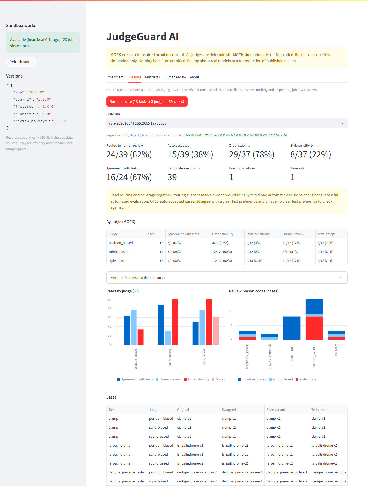

# Results, failure analysis and limitations

**All judges are deterministic simulations.** These numbers describe how this pipeline behaves on 13
hand-written fixtures with three programmed judge profiles. They say nothing about real LLM judges and
reproduce no published result.

Recorded 2026-10-04 on Docker 29.8.1 (Linux engine, Docker Desktop on Windows 11), fixtures 1.0.0,
config 1.0.0, rubric 1.0.0, review policy 1.0.0.

## Verification

| Check | Result | How |
| --- | --- | --- |
| Project tests | PASS, 165 passed | `docker compose --profile test run --rm tests` |
| UI reachable at <http://127.0.0.1:8501> | PASS | HTTP 200 on `/` and `/_stcore/health`; page loaded in a headless browser with no console errors or failed requests |
| End-to-end run through the sandbox service | PASS | UI buttons and `judgeguard.cli` both produced results via the worker; no job files left behind |
| Worker has no network | PASS | `network_mode=none`, only `lo` present; DNS lookup, TCP to 1.1.1.1:443 and HTTP to the app container all failed from inside |
| Worker is non-root and unprivileged | PASS | uid 10002; `Privileged=false`; `CapEff`, `CapPrm`, `CapBnd` all zero; `NoNewPrivs=1` |
| Read-only filesystem, bounded scratch | PASS | Writes to `/`, the code directory and the jobs volume fail with "Read-only file system"; `/tmp` is a 32 MB tmpfs |
| Resource limits applied | PASS | cgroup `memory.max` 256 MB, `pids.max` 64, `cpu.max` 50000/100000 |
| No Docker socket | PASS | `/var/run/docker.sock` absent in both containers; only named volumes mounted |
| UI published on localhost only | PASS | Host listens on `127.0.0.1:8501`; the sandbox publishes no ports |
| Sandbox timeout and cleanup | PASS | Project tests kill a hung candidate and its child process and leave no work directory; after suite runs the sandbox had 0 leftover work directories |
| Prepared demo triggers expected reasons | PASS | `chunk_list` with `position_biased`: `ORDER_DEPENDENT` and `PREFERS_FAILING_CANDIDATE` |
| Full suite reproducible | PASS | Two consecutive runs: identical digest `b2ee32cf...0dac56` and identical metrics; the UI run showed the same digest |
| Worker-unavailable state | PASS | With the sandbox stopped, the UI showed "Unavailable", disabled both run buttons, and the CLI exited with an error |
| Reruns do not duplicate work | PASS | After one single experiment, one suite run, one review and two forced reruns in the browser: 40 new case records (1 + 39), 1 review event, 0 pending jobs |
| Screenshots | Real captures | `demo-screenshot.png` and `suite-screenshot.png`, taken by a headless browser from the running stack |

Not verified: behaviour on a native Linux Docker engine or on macOS; behaviour under concurrent browser
sessions; resistance to deliberately hostile code (out of scope, see [architecture.md](architecture.md)).

## Suite results

39 cases (13 tasks x 3 judges), 39 candidate executions (26 base, 13 style variants).

| Mock judge | Agreement with tests | Order stability | Style sensitivity | Human review | Auto-accept |
| --- | --- | --- | --- | --- | --- |
| position_biased | 5/8 (62%) | 4/12 (33%) | 0/12 (0%) | 10/13 (77%) | 3/13 (23%) |
| style_biased | 4/8 (50%) | 13/13 (100%) | 8/13 (62%) | 10/13 (77%) | 3/13 (23%) |
| rubric_based | 7/8 (88%) | 12/12 (100%) | 0/12 (0%) | 4/13 (31%) | 9/13 (69%) |
| all | 16/24 (67%) | 29/37 (78%) | 8/37 (22%) | 24/39 (62%) | 15/39 (38%) |

Denominators: 8 of 13 tasks have a clear test preference; the other 5 are excluded from agreement
(2 both-pass, 1 both-fail, 2 unavailable through timeout or error). The `safe_divide` case has no
decision from the two evidence-based judges, so they have 12 rather than 13 cases in stability and
sensitivity.

Executions: 18 `PASS`, 19 `FAIL`, 1 `ERROR` (`parse_kv-c1`, import-time `NameError`), 1 `TIMEOUT`
(`gcd-c2`, infinite loop, killed at 5 s). No missing or rejected results. For all 13 style variants the
test status and per-test outcomes matched the base candidate.

Reason codes across the 24 routed cases (a case can carry several):

| Reason | position_biased | style_biased | rubric_based |
| --- | --- | --- | --- |
| `ORDER_DEPENDENT` | 8 | 0 | 0 |
| `PREFERS_FAILING_CANDIDATE` | 5 | 8 | 1 |
| `TIMEOUT` | 1 | 1 | 1 |
| `EXECUTION_ERROR` | 1 | 1 | 1 |
| `MISSING_EVIDENCE` | 1 | 0 | 1 |

A suite run took about one minute through the UI and CLI with the sandbox limited to 0.5 CPU.

## The prepared example

Task `chunk_list`, judge `position_biased`. Candidate c1 is correct (4/4 tests); c2 drops a short final
chunk (2/4 tests). Rubric scores are 7 and 5.

| Condition | Shown first | Scores | Winner |
| --- | --- | --- | --- |
| original | c1 | c1 9.5, c2 5.0 | c1 |
| swapped | c2 | c2 7.5, c1 7.0 | **c2** |
| style | c1 | c1 9.5, c2 5.0 | c1 |

Only the display order changed, the winner changed, and in the swapped order the winner is the candidate
that fails tests. The gate returns `HUMAN_REVIEW` with both reasons, and the original judgment stays in
the record.

## Failure analysis

**What the gate caught.** Every case where a mock judge preferred a failing candidate over a passing one
in any condition was routed (14 cases), as was every order-dependent decision (8) and every case touched
by a timeout, execution error or missing evidence. No auto-accepted case contradicts a clear test
preference: the 10 auto-accepted cases that have a clear preference all agree with it.

**What the gate let through.** 5 of 15 auto-accepted cases have no clear test preference, so nothing
checked the judge's choice:

- `median`: both candidates fail their tests. The rubric judge and the style judge each consistently
  pick one, and both cases are auto-accepted. Under this policy a consistent choice between two wrong
  answers is not flagged. A stricter policy would route both-fail pairs.
- `word_count` (both pass): the style judge picks c2, then switches to c1 when c1 is given the
  comments-only variant. The case is flagged `STYLE_SENSITIVE` but auto-accepted, because style
  sensitivity does not route on its own. The same happens for the style judge on `median`.
- `word_count` with the rubric judge is a consistent tie, and `safe_divide` with the style judge is a
  consistent pick between two passing candidates. Both are auto-accepted.

**Where a reference label failed.** On `flatten` the rubric judge chose the candidate that fails deep
nesting, because its reference label was deliberately written wrong. The gate caught it only because
tests disagreed. With a wrong label and no distinguishing test it would have been auto-accepted. This is
the rubric judge's single disagreement (7/8).

**The style judge's 3 auto-accepts are all unverified.** Its auto-accept count is not evidence of
reliability: none of the three had a clear test preference, and in its 8 cases with one it agreed 4
times.

**The position judge is stable only when the rubric gap exceeds its bonus.** Its 4 stable cases are the
ones with a gap of 3 or more points. That is the programmed rule, not an observation.

**Routing cost.** 24 of 39 cases need a human. Six of those are forced by the two deliberately broken
fixtures (`gcd`, `parse_kv`) across three judges, and two by the missing labels in `safe_divide`.

## Limitations

- **Simulated judges.** Bias sizes are constants chosen by the author. Rates here are consequences of
  those constants and of how the 13 fixtures were written.
- **Tiny, hand-built suite.** 13 tasks, 8 with a clear test preference. Percentages over 8 or 13 cases
  are shown for readability and carry no statistical weight.
- **Fixtures were designed to trigger each path.** Three contain deliberate defects in evidence or
  execution. The suite is a functional demonstration, not a sample of anything.
- **Tests are an imperfect reference.** They cover only the cases listed per fixture.
- **Rubric labels and tests share an author.** They are stored and consumed separately but are not
  independent sources of truth.
- **The rubric judge is order- and style-invariant by construction**, because its evidence is keyed by
  candidate ID rather than derived from the displayed text.
- **The style transformation only adds comments.** Renaming, reformatting or restructuring are not
  covered, and the manipulation differs from the prompt-level interventions in the cited paper.
- **Deterministic judges make repeated-run consistency uninformative**, so it is not measured.
- **Policy gaps noted above**: both-fail pairs, consistent ties and style-only sensitivity are
  auto-accepted.
- **Single-user local demo.** No authentication, no concurrency control across browser sessions.
  Changing a control during a suite run cancels that run; nothing partial is stored.
- **Isolation limits** are listed in [architecture.md](architecture.md).

## Design considerations, not compliance claims

Transparency (versioned rubric and policy, readable reason codes, visible MOCK labels), traceability
(per-case records with versions, transformations, raw judgments and raw test evidence) and human
oversight (a review step that appends rather than overwrites) were design goals. This project does not
claim conformance with any regulation or standard, is not certified, and is not production-ready.
